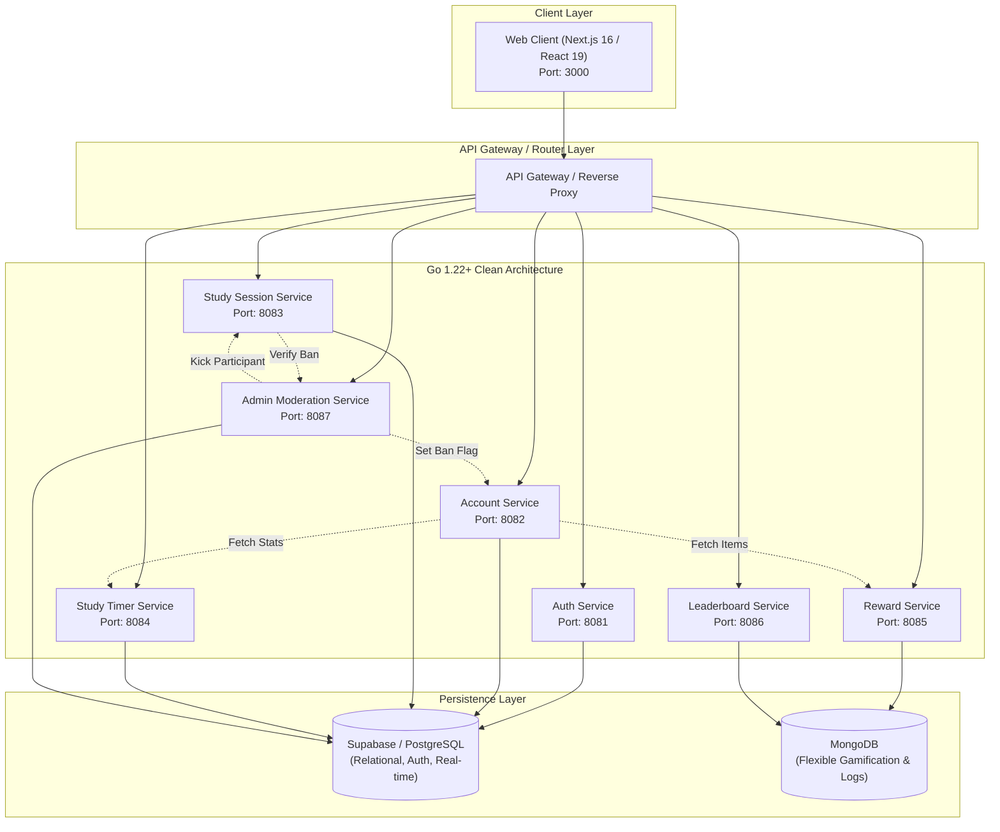

# Fisher Timer System Architecture

> **Notice to AI Agents:** This is the authoritative, living architectural documentation for the Fisher Timer system. Whenever services, endpoints, inter-service communications, database models, or infrastructure changes are introduced, this file MUST be updated in compliance with [`docs/skill-set/2-update-architecture/SKILL.md`](skill-set/2-update-architecture/SKILL.md).

---

## 1. High-Level Architecture Overview

Fisher Timer utilizes an event-aware microservices architecture on the backend coupled with a Next.js frontend client, organized within a high-performance Turborepo monorepo.



---

## 2. Microservice Topology & Port Registry

All backend services follow Clean / Hexagonal Architecture (Domain -> Usecase -> Adapter).

| Service Name | Port | Directory | Protocol | Primary Store | Responsibilities |
| :--- | :--- | :--- | :--- | :--- | :--- |
| **Web** | 3000 | `apps/web` | HTTP / WS | - | Responsive student & admin UI, live timer render. |
| **Auth** | 8081 | `services/auth` | HTTP / REST | Supabase | Google OAuth, JWT issuance & verification. |
| **Account** | 8082 | `services/account` | HTTP / REST | Supabase | Profiles, personal stats aggregation, ban records. |
| **Study Session** | 8083 | `services/study-session` | HTTP / REST / WS | Supabase | Room lifecycles, roster limits, real-time presence. |
| **Study Timer** | 8084 | `services/study-timer` | HTTP / REST | Supabase | Isolated user focus timers, work/break cycles. |
| **Reward** | 8085 | `services/reward` | HTTP / REST | MongoDB | Gamified fish drops, inventory, milestone tracker. |
| **Leaderboard** | 8086 | `services/leaderboard` | HTTP / REST | MongoDB | Fast read-cached rankings by period (weekly/all-time). |
| **Admin** | 8087 | `services/admin` | HTTP / REST / WS | Supabase | Real-time session monitoring, reports, user bans. |

---

## 3. Service Collaboration & Communication Matrix

As defined in `docs/phase1/microservice.md`:

```
+---------------+------------------------+------------------------------------------+
| Source Service| Target Service & Call  | Reason / Trigger                         |
+---------------+------------------------+------------------------------------------+
| Account       | StudyTimer.Statistics()| Aggregate total focus time on dashboard  |
| Account       | Reward.ViewRewards()   | Render earned fish collection on profile |
| Study Session | Admin.VerifyBanStatus()| Block banned users from creating/joining |
| Admin         | StudySession.Leave()   | Kick banned or reported users from rooms |
| Admin         | Account.UpdateBanStatus| Write ban flag to user account record    |
+---------------+------------------------+------------------------------------------+
```

---

## 4. Backend Service Architecture (Hexagonal / Clean)

Every Go microservice conforms to the following layer boundaries:

```
services/<service-name>/
├── cmd/
│   └── main.go                  # Composition root: wires dependencies & starts HTTP server
├── config/
│   └── config.go                # Strongly typed environment variable loader
├── internal/
│   ├── domain/                  # CORE: Entities, Value Objects, Domain errors, Repository interfaces
│   │   ├── entity.go
│   │   └── repository.go
│   ├── usecase/                 # APPLICATION: Business logic orchestration (independent of frameworks)
│   │   ├── service.go
│   │   └── service_test.go
│   └── adapter/                 # INFRASTRUCTURE: Technical implementations (driving & driven)
│       ├── handler/             # HTTP / REST handlers, parameter binding, status codes
│       │   └── http_handler.go
│       └── repository/          # Database access (Supabase, Mongo, in-memory mocks)
│           └── memory_repo.go
```

**Golden Rule of Clean Architecture:**
Dependencies point **inwards**. The `domain` layer has zero dependencies on frameworks, databases, or external libraries. The `usecase` layer depends only on `domain`. The `adapter` layer implements interfaces declared by `domain`.

---

## 5. Shared Contracts & Types

Domain data structures shared across services and the web client are maintained in:
- `packages/shared-types/src/index.ts` (TypeScript interfaces for Frontend & API consumers)
- Standard Protobuf/JSON schema definitions for Go inter-service contracts.
