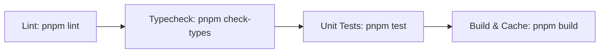

# Way of Work (Engineering Guidelines for AI Agents & Engineers)

> **Notice to AI Agents:** This guide defines our engineering principles, testing methodologies, build workflows, and quality standards. Before executing tasks or modifying code, consult this guide and the associated skill at [`docs/skill-set/3-way-of-work/SKILL.md`](skill-set/3-way-of-work/SKILL.md).

---

## 1. Core Engineering Principles

1. **Non-Breaking Incremental Changes:** Always verify existing services and build pipelines continue passing after any modifications.
2. **Clean Layer Decoupling:** Respect Clean/Hexagonal boundaries. Never import HTTP handlers or database drivers inside `internal/domain` or `internal/usecase`.
3. **Reproducibility & Automation:** Any repetitive task or workspace generation should be codified as a script in `scripts/`.
4. **Documentation as Code:** Code and architectural documentation must evolve in lockstep. Updating an API contract without updating `ARCHITECTURE.md` and `CHANGELOG.md` is considered an incomplete task.

---

## 2. Testing & Verification Standard

Every pull request or task execution MUST pass the four-tier verification check:



### 1. Static Analysis & Linting
```bash
# Monorepo-wide linting
pnpm lint

# Target a specific service
pnpm turbo lint --filter=@fishertimer/auth-service
```
- Go services run `go vet ./...`.
- TypeScript/Next.js projects run ESLint with `@repo/eslint-config`.

### 2. Type Checking
```bash
pnpm check-types
```
Ensures that all TypeScript interfaces in `apps/web` and `packages/*` are valid with zero compile-time type errors.

### 3. Automated Unit Testing
```bash
# Run all tests
pnpm test

# Run tests for a specific microservice with verbose output
pnpm turbo test --filter=@fishertimer/study-timer-service
```
- Go tests are placed alongside code as `*_test.go` and run via `go test -v -race ./...`.
- Always mock external databases using repository interfaces defined in `internal/domain`.

### 4. Production Build & Full Turbo Cache Hit
```bash
# First run builds artifacts
pnpm build

# Second run validates Turborepo caching (should be FULL TURBO)
pnpm build
```

---

## 3. Environment & Cross-Platform Gotchas

When developing on Windows with Go & Turborepo:
1. **PowerShell Execution Policy:** Running `.ps1` files directly may be blocked by system security policies. Always run commands through standard CMD or pass explicit execution flags:
   ```bash
   cmd /c "pnpm <command>"
   ```
2. **Go Build Cache on Windows:** Turborepo v2 isolates environment variables by default. The following variables are whitelisted in `turbo.json` under `globalPassThroughEnv`:
   - `LocalAppData`, `LOCALAPPDATA`, `GOCACHE`, `GOPATH`, `GOROOT`, `PATH`, `USERPROFILE`, `SystemRoot`, `HOME`.
   Do NOT remove these from `turbo.json`, or `go build` will fail with cache errors.

---

## 4. Git & Commit Guidelines

We use conventional commit messages:
- `feat: <description>` - New features or capabilities.
- `fix: <description>` - Bug fixes and corrections.
- `refactor: <description>` - Code refactoring without behavior changes.
- `docs: <description>` - Documentation updates.
- `test: <description>` - Adding or updating unit/integration tests.
- `chore: <description>` - Build system, scripts, or dependency updates.

Always update `/docs/CHANGELOG.md` in the same commit or PR as your code changes.
