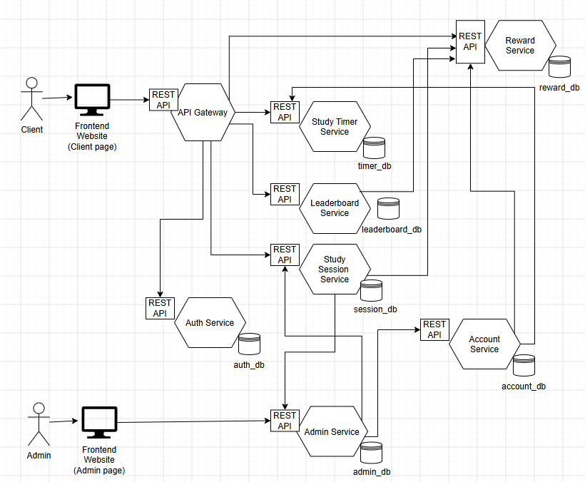

| Service       | Operations                                                                                                                                | Collaborators                                                            |
| ------------- | ----------------------------------------------------------------------------------------------------------------------------------------- | ------------------------------------------------------------------------ |
| Account       | SignIn() SignUp() SignOut() ViewProfile() UpdateProfile() ViewStatistics()                                                | StudyTimer Service TimerStatistics() Reward Service ViewRewards()     |
| Study Session | CreateSession() JoinSession() LeaveSession() EndSession() ListActiveSession() GetParticipants()                             | -                                                                        |
| Study Timer   | StartTimer() PauseTimer() ResumeTimer() StopTimer() ResetTimer() CompleteCycle() SkipRest() UpdateTimerSetting()         | Reward Service AwardReward()                                             |
| Reward        | AwardReward() ViewRewards()                                                                                                            | -                                                                        |
| Leaderboard   | ViewLeaderboard() GetRanking()                                                                                                         | Reward Service ViewRewards()                                             |
| Admin         | ViewActiveSessions() ViewParticipants() ViewSessionDetails()                                                                        | StudySession Service LeaveSession() StudySession Service EndSession()  |

Account
Detail : Handles user authentication, profiles, and personal statistic dashboard.
Database: account_db
Operations :
SignIn : Authenticates users via Google OAuth.
SignUp : Creates a new user profile on first login.
SignOut : Invalidates the user's current session.
ViewProfile : Displays the user's information like email and display name.
UpdateProfile : Updates user details like display name.
ViewStatistics : Aggregates total sessions, focus time, and rewards earned.
Collaboration :
StudyTimer Service TimerStatistics() : Fetches user timer history for the dashboard.
Reward Service ViewRewards() : Fetches earned rewards for the dashboard.

Study Session
Detail : Manages the lifecycle of study session rooms and participant limits.
Protocol : gRPC / HTTP
Database: session_db
Operations :
CreateSession : Opens a new study room with configured capacities.
JoinSession : Adds a participant to the active study session room.
LeaveSession : Removes a participant from the active study session room.
EndSession : Closes study session room when all participant leaves or admin command.
ListActiveSession() : Get all active study session room for admin service.
GetParticipants() : Get all active participant in each study session for admin service.
Collaboration :
none

Study Timer
Detail : Runs independent user timers, handles cycle and work and rest phase.
Protocol : gRPC / HTTP
Database: timer_db
Operations :
StartTimer : Initiates a new timer cycle.
PauseTimer : Pauses an ongoing timer cycle (for both work or rest phase)
ResumeTimer : Resumes a previously paused timer cycle (for both work or rest phase)
StopTimer : Finalizes a timer and discards in-progress cycles, this is not complete cycle.
ResetTimer : Resets the timer progress in that cycles.
CompleteCycle : After completed cycle (complete timer in duration of this phase), will call AwardReward switch between work and rest phase.
SkipRest : skip the rest period to return to a work phase.
UpdateTimerSetting : Modifies the default work and rest durations of timer.
Collaboration :
Reward Service AwardReward() : Triggered when CompleteCycle to give reward to user

Reward
Detail : Calculates and grants items based on cycle length and study session participant count.
Database: reward_db
Operations :
AwardReward : Rolls for items using a rarity table buffed by study session participant.
ViewRewards : Displays accumulated items in the user's collection.
Collaboration :
None

Leaderboard
Detail : Provides a read-optimized ranking of users based on total rewards.
Database: None (Uses Redis cache; standalone leaderboard_db removed)
Operations :
ViewLeaderboard : Displays the leaderboard dashboard interface. Can be filtered rankings to Weekly, Monthly, or All-Time. Will check redis cache first.
GetRanking : Retrieves the list of users ranked by total rewards using Reward Service ViewRewards function.
Collaboration :
Reward Service ViewRewards() : Fetches earned rewards for leaderboard ranking.

Admin
Detail : Bundles real-time session monitoring with moderation capabilities.
Database: admin_db
Operations :
ViewActiveSessions : List all to live study session room states.
ViewParticipants : Lists the users currently in each study session room.
ViewSessionDetails : Displays information about a specific study session room.
Collaboration :
StudySession Service LeaveSession() : Sends command to kick users from study session.
StudySession Service EndSession() : Sends command to end study session.

Diagram

