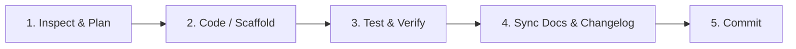

# Skill 3: Way of Work & Lessons Learned

## Objective
Guide AI agents through testing, verification, error diagnosis, and institutional learning, ensuring each agent leaves the codebase healthier and documents encountered mistakes in [`/docs/LESSONS_LEARNED.md`](../../LESSONS_LEARNED.md).

---

## 1. Standard Agent Execution Lifecycle

For every user task, follow this strict lifecycle:



---

## 2. Mandatory Verification Protocol

Before declaring any coding task complete, run the following verification suite:

```bash
# 1. Typecheck all TypeScript code
pnpm check-types

# 2. Lint all packages and Go services
pnpm lint

# 3. Execute unit tests across all workspaces
pnpm test

# 4. Build all services & verify Turborepo cache
pnpm build
```

If any step fails:
1. Do not ignore the failure or proceed to commit.
2. Read the full error message and stack trace.
3. Fix the underlying root cause.
4. If the error was subtle or took troubleshooting effort, log it in [`/docs/LESSONS_LEARNED.md`](../../LESSONS_LEARNED.md).

---

## 3. How to Document Bugs & Learnings in `LESSONS_LEARNED.md`

Whenever you encounter and solve:
- A non-obvious build or compilation error.
- An environment-specific bug (e.g., Windows pathing, execution policies, environment variable stripping).
- A hydration mismatch or SSR/CSR boundary bug in Next.js.
- A concurrency deadlock, race condition, or memory leak in Go goroutines.

Append an entry to [`/docs/LESSONS_LEARNED.md`](../../LESSONS_LEARNED.md) using the standard format:

```markdown
### Incident <Next_ID>: <Title>
- **Date:** YYYY-MM-DD
- **Component:** <Service / Package / Tool>
- **Symptom:** <Error text or symptom>
- **Root Cause:** <Why it happened>
- **Solution:** <How it was fixed>
- **Action for Future Agents:** <Rule to prevent recurrence>
```

---

## 4. Continuous Improvement Heuristics for Agents

- **No Premature Optimization:** Implement the simplest clean design that satisfies the acceptance criteria.
- **Fail Fast & Explicitly:** Return typed errors instead of silent panics or empty responses.
- **Isolate Side Effects:** Never initiate HTTP requests or write database records in the domain entity constructors.
- **Preserve Documentation Integrity:** Always maintain and update docstrings, comments, and related markdown files.
